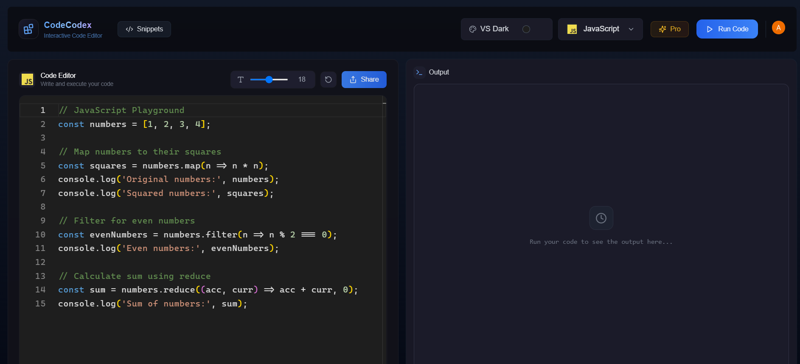

# Code Codex 🚀
### Your Next-Generation Online IDE



## 🌟 Introduction

Code Codex is a cutting-edge online IDE that transforms the way developers write, test, and share code. Built with the latest technologies and designed with developer experience in mind, it offers a seamless, feature-rich environment for coding enthusiasts and professionals alike.

## ✨ Key Features

### 💻 Advanced IDE Capabilities
- **Multi-Language Support**: Write and execute code in 10 different programming languages
- **Real-Time Compilation**: Instant feedback as you code
- **Smart Output Handling**: Clearly differentiated success and error states
- **VSCode Integration**: 5 customizable themes to match your preferred coding environment
- **Adjustable Font Sizes**: Personalize your coding experience

### 🎯 Professional Tools
- **Profile Dashboard**: Track your coding journey and execution history
- **Statistics Overview**: Comprehensive insights into your coding patterns
- **Community Code Sharing**: Learn from and contribute to a growing developer community
- **Advanced Search**: Find exactly what you need with powerful filtering capabilities

### 💎 Premium Features
- **Pro Plan Benefits**: Enhanced capabilities for serious developers
- **Webhook Integration**: Connect with your favorite tools and services
- **Custom Themes**: Additional visual customization options
- **Priority Support**: Dedicated assistance for Pro users

## 🛠️ Technology Stack

- **Frontend**: Next.js 15 with TypeScript
- **Backend**: Convex for real-time data synchronization
- **Authentication**: Clerk for secure user management
- **Styling**: Tailwind CSS for modern, responsive design

### Setup .env file

```js
NEXT_PUBLIC_CLERK_PUBLISHABLE_KEY=
CLERK_SECRET_KEY=
CONVEX_DEPLOYMENT=
NEXT_PUBLIC_CONVEX_URL=
```

### Add these env to Convex Dashboard

```js
CLERK_WEBHOOK_SECRET=
LEMON_SQUEEZY_WEBHOOK_SECRET=
```

### Run the app

```shell
npm run dev
```

## 📈 Future Roadmap

- [ ] AI-powered code suggestions
- [ ] Team collaboration features
- [ ] Additional language support
- [ ] Enhanced analytics dashboard
- [ ] Mobile app integration

## 🌟 Acknowledgments

Special thanks to:
- The amazing open-source community
- Contributors who helped shape this project

---

Built with ❤️ by Asad Raza